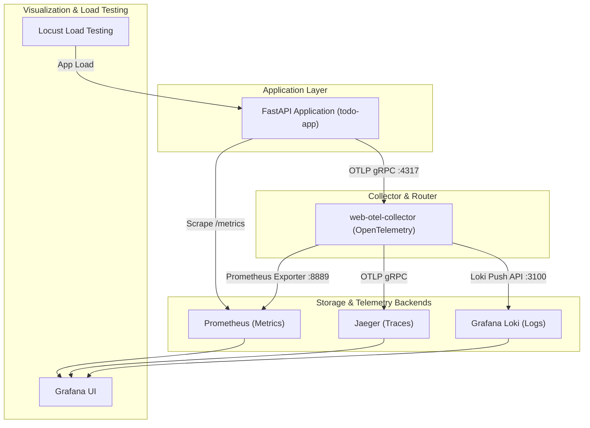

# Monitoring & Observability Architecture

This directory contains the configuration files for the observability stack (Metrics, Traces, and Logs) using **Prometheus**, **OpenTelemetry Collector**, **Jaeger**, **Grafana**, and **Loki**.

---

## Observability Stack Overview



---

## Services & Ports

| Service | Container Name | Port | Description |
| :--- | :--- | :--- | :--- |
| **Grafana** | `grafana` | [`http://localhost:3000`](http://localhost:3000) | Dashboard UI (Default login: `admin`/`admin`) |
| **Prometheus** | `prometheus` | [`http://localhost:9090`](http://localhost:9090) | Metrics collection & time-series database |
| **Jaeger** | `jaeger` | [`http://localhost:16686`](http://localhost:16686) | Distributed tracing UI |
| **Loki** | `loki` | [`http://localhost:3100`](http://localhost:3100) | Log aggregation backend engine |
| **OTel Collector** | `web-otel-collector` | `:4317` (gRPC), `:4318` (HTTP) | OpenTelemetry collector for traces & logs |
| **Locust Master** | `locust-master` | [`http://localhost:8089`](http://localhost:8089) | Load testing web dashboard |
| **Locust Exporter**| `web-locust-exporter`| `:9646` | Prometheus exporter for Locust metrics |

---

## Telemetry Pipelines

### 1. Logs Pipeline (FastAPI -> OTel Collector -> Loki -> Grafana)
* **Application Instrumentation**: The application initializes an OpenTelemetry `LoggingHandler` attached to Python's root logger in [`app/core/logger.py`](../../app/core/logger.py).
* **Collector Forwarding**: The OTel Collector receives logs on OTLP port `4317` and forwards them to Loki via the `loki` exporter configured in [`otel-config.yaml`](./otel-config.yaml).
* **Grafana Visualization**: Loki is auto-provisioned as a default datasource in Grafana via [`grafana-datasources.yml`](./grafana-datasources.yml).
* **LogQL Query Example**:
  ```logql
  {service_name="todo-app"}
  ```

### 2. Traces Pipeline (FastAPI -> OTel Collector -> Jaeger)
* **Application Instrumentation**: `FastAPIInstrumentor` and `OTLPSpanExporter` capture HTTP request spans.
* **Collector Forwarding**: OTel Collector forwards traces to Jaeger over OTLP gRPC (`jaeger:4317`).

### 3. Metrics Pipeline (FastAPI -> Prometheus)
* **Prometheus Instrumentator**: Exposes endpoint `/metrics` on FastAPI.
* **Prometheus Scraping**: Prometheus scrapes FastAPI directly via target configuration in [`prometheus.yml`](./prometheus.yml).

---

## Configuration Files

- [`otel-config.yaml`](./otel-config.yaml): OpenTelemetry Collector pipelines for traces, logs, and metrics.
- [`prometheus.yml`](./prometheus.yml): Target definitions for Prometheus scraping.
- [`grafana-datasources.yml`](./grafana-datasources.yml): Auto-provisioned Grafana datasources (Prometheus & Loki).
