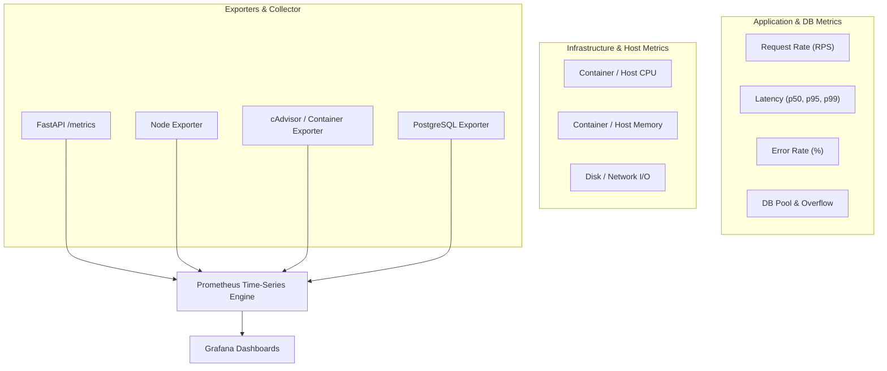

# Performance Benchmarking & Infrastructure Monitoring Audit

This document outlines the performance benchmarking requirements, metrics specification, telemetry audit results, and an actionable implementation checklist for the application monitoring stack (Prometheus, Grafana, OpenTelemetry, Loki, Jaeger, and Locust).

---

## 1. Metric Architecture & Requirements

To achieve production-grade observability and benchmark system capabilities during load testing, the following five core telemetry pillars must be monitored in real time.



### Core Metrics Specification

| Metric Group | Specific Metric Name | Unit | Source Exporter | PromQL / Logic Example | Target SLA / Threshold |
| :--- | :--- | :--- | :--- | :--- | :--- |
| **Throughput** | Requests Per Second (RPS) | req/s | FastAPI Instrumentator | `sum(rate(http_requests_total[1m]))` | High throughput load baseline |
| **Latency** | $p50, p90, p95, p99$ Percentiles | seconds / ms | FastAPI Instrumentator | `histogram_quantile(0.95, sum(rate(http_request_duration_seconds_bucket[1m])) by (le, handler))` | $p95 < 200\text{ms}, p99 < 500\text{ms}$ |
| **Error Rate** | 4xx / 5xx Error Percentage | % | FastAPI Instrumentator | `(sum(rate(http_requests_total{status=~"5.*"}[1m])) / sum(rate(http_requests_total[1m]))) * 100` | $< 0.1\%$ 5xx errors |
| **DB Pool Size** | Total Pool Connections | integer | Custom SQLAlchemy Collector | `sqlalchemy_pool_size` | Matches configured `pool_size` |
| **DB Checked Out** | Active Busy DB Connections | integer | Custom SQLAlchemy Collector | `sqlalchemy_pool_checked_out` | $< 80\%$ of total pool size |
| **DB Overflow** | Current Overflow Connections | integer | Custom SQLAlchemy Collector | `sqlalchemy_pool_overflow` | $< max\_overflow$ setting |
| **DB Timeout/Wait**| DB Pool Timeout Count | counter | Custom SQLAlchemy Collector | `increase(sqlalchemy_pool_timeouts_total[5m])` | `0` (Zero timeout rate) |
| **Container CPU** | CPU Usage | % / cores | cAdvisor / Node Exporter | `sum(rate(container_cpu_usage_seconds_total{name="todo_app"}[1m])) * 100` | $< 75\%$ CPU utilization |
| **Container RAM** | Resident Memory (RSS) | bytes / MB | cAdvisor / Node Exporter | `container_memory_usage_bytes{name="todo_app"}` | Below container memory limit |

---

## 2. Infrastructure & Telemetry Audit Matrix

### Current State vs Target State

| Monitoring Component | Current Implementation | Audit Finding / Gap | Action Required |
| :--- | :--- | :--- | :--- |
| **Application Metrics** | `prometheus-fastapi-instrumentator` in [`app/main.py`](../../app/main.py) | Basic endpoint histogram metrics collected | Add custom metrics for SQLAlchemy DB pool utilization & query timings |
| **System Host / Node Exporter** | Missing in [`docker-compose.yml`](../../docker-compose.yml) | No container or host CPU/Memory/Disk telemetry collected | Add `node-exporter` and `cadvisor` services to Docker Compose & Prometheus scrape targets |
| **Database Pool Telemetry** | Async SQLAlchemy engine in [`app/db/session.py`](../../app/db/session.py) | Default engine settings, no pool monitoring attached | Configure explicit pool limits (`pool_size`, `max_overflow`) and expose pool metrics to Prometheus |
| **Log Structure & Correlation** | JSON logging in [`app/core/logger.py`](../../app/core/logger.py) | Missing automatic OTel `trace_id` and `span_id` context injection | Update JSON formatter to inject active OpenTelemetry trace context into all log outputs |
| **Grafana Dashboards** | Only datasources configured in [`grafana-datasources.yml`](./grafana-datasources.yml) | No pre-configured dashboard JSON models provisioned | Provision Grafana dashboards via file system (`/etc/grafana/provisioning/dashboards`) |
| **Locust Load Testing** | `locust-master` & `web-locust-exporter` running | Exporter metrics available at port `:9646` | Integrate Locust exporter metrics into main Grafana performance dashboard |

---

## 3. Actionable Implementation Checklists

Follow these checklists to implement and verify the required telemetry enhancements.

### Checklist 1: Structured Log Format & OpenTelemetry Trace Correlation

- [ ] **Inject OTel Context into Logger**: Update [`app/core/logger.py`](../../app/core/logger.py) to automatically append `trace_id` and `span_id` to standard JSON log records so Loki and Jaeger trace navigation links match seamlessly in Grafana.
- [ ] **Standardize HTTP Access Log Schema**: Ensure every request log contains standard fields:
  ```json
  {
    "timestamp": "2026-08-26T13:47:50Z",
    "level": "INFO",
    "service.name": "todo-app",
    "trace_id": "a1b2c3d4e5f67890",
    "span_id": "1234567890abcdef",
    "http.method": "POST",
    "http.path": "/api/v1/todo/",
    "http.status_code": 201,
    "duration_ms": 42.5,
    "db_query_time_ms": 12.3,
    "message": "Processed POST /api/v1/todo/"
  }
  ```
- [ ] **Verify Loki Log Ingestion**: Run `LogQL` query in Grafana:
  ```logql
  {service_name="todo-app"} | json | status_code >= 400
  ```

---

### Checklist 2: Exporter Infrastructure (`docker-compose.yml` & `prometheus.yml`)

- [ ] **Add Node Exporter & cAdvisor Services** to [`docker-compose.yml`](../../docker-compose.yml):
  ```yaml
    node-exporter:
      image: prom/node-exporter:latest
      container_name: node-exporter
      ports:
        - "9100:9100"
      networks:
        - todo_network

    cadvisor:
      image: gcr.io/cadvisor/cadvisor:latest
      container_name: cadvisor
      ports:
        - "8080:8080"
      volumes:
        - /:/rootfs:ro
        - /var/run:/var/run:ro
        - /sys:/sys:ro
        - /var/lib/docker/:/var/lib/docker:ro
      networks:
        - todo_network
  ```
- [ ] **Update Prometheus Scrape Targets** in [`infra/monitoring/prometheus.yml`](./prometheus.yml):
  ```yaml
    - job_name: "node-exporter"
      static_configs:
        - targets: ["node-exporter:9100"]

    - job_name: "cadvisor"
      static_configs:
        - targets: ["cadvisor:8080"]
  ```

---

### Checklist 3: Database Connection Pool & Performance Instrumentation

- [ ] **Configure SQLAlchemy Engine Pool Parameters** in [`app/db/session.py`](../../app/db/session.py):
  ```python
  engine = create_async_engine(
      base_settings.db_url,
      pool_size=20,
      max_overflow=10,
      pool_timeout=30,
      pool_recycle=1800,
      echo=base_settings.is_dev,
  )
  ```
- [ ] **Attach Prometheus Gauge Collectors for Database Pool**:
  Register custom Prometheus gauges tracking:
  - `sqlalchemy_pool_size`: Total configured pool size.
  - `sqlalchemy_pool_checked_out`: Connections currently in active use.
  - `sqlalchemy_pool_overflow`: Active overflow connections.
  - `sqlalchemy_pool_checked_in`: Idle available connections.
- [ ] **Implement Listener Instrumentation** (`sqlalchemy.events`):
  ```python
  from prometheus_client import Gauge

  DB_POOL_SIZE = Gauge("sqlalchemy_pool_size", "Configured DB pool size")
  DB_POOL_CHECKED_OUT = Gauge("sqlalchemy_pool_checked_out", "Checked out DB connections")
  DB_POOL_OVERFLOW = Gauge("sqlalchemy_pool_overflow", "Current DB pool overflow count")

  def update_pool_metrics(engine):
      pool = engine.pool
      DB_POOL_SIZE.set(pool.size())
      DB_POOL_CHECKED_OUT.set(pool.checkedout())
      DB_POOL_OVERFLOW.set(pool.overflow())
  ```

---

### Checklist 4: Grafana Provisioning & Performance Dashboard Setup

- [ ] **Create Dashboard Provisioning Directory Structure**:
  - `infra/monitoring/dashboards/performance_dashboard.json`
  - `infra/monitoring/grafana-dashboards.yml`
- [ ] **Mount Dashboards Volume in `docker-compose.yml`**:
  ```yaml
    volumes:
      - grafana-storage:/var/lib/grafana
      - ./infra/monitoring/grafana-datasources.yml:/etc/grafana/provisioning/datasources/datasources.yml
      - ./infra/monitoring/grafana-dashboards.yml:/etc/grafana/provisioning/dashboards/dashboards.yml
      - ./infra/monitoring/dashboards:/var/lib/grafana/dashboards
  ```
- [ ] **Build Grafana Panels using PromQL Queries**:

#### Panel 1: Throughput (RPS)
```promql
sum(rate(http_requests_total[1m])) by (handler, method)
```

#### Panel 2: Latency Percentiles ($p50, p95, p99$)
```promql
# p95 Latency
histogram_quantile(0.95, sum(rate(http_request_duration_seconds_bucket[1m])) by (le, handler))

# p99 Latency
histogram_quantile(0.99, sum(rate(http_request_duration_seconds_bucket[1m])) by (le, handler))
```

#### Panel 3: Error Rate Percentage (%)
```promql
(sum(rate(http_requests_total{status=~"5.*"}[1m])) / sum(rate(http_requests_total[1m]))) * 100
```

#### Panel 4: Database Connection Pool Utilization
```promql
# Checked Out vs Total Pool Size
sqlalchemy_pool_checked_out / sqlalchemy_pool_size * 100

# Overflow Connections
sqlalchemy_pool_overflow
```

#### Panel 5: Container System Resources (CPU & Memory)
```promql
# CPU Utilization (%)
sum(rate(container_cpu_usage_seconds_total{name="todo_app"}[1m])) * 100

# Memory Usage (MB)
container_memory_usage_bytes{name="todo_app"} / 1024 / 1024
```

#### Panel 6: Locust Load Test Live RPS & User Count
```promql
# Locust User Count
locust_user_count

# Locust Current RPS
locust_requests_per_second
```

---

## 4. Benchmarking Workflow & Validation

1. **Start System Stack**:
   ```bash
   docker-compose up -d --build
   ```
2. **Execute Load Benchmark with Locust**:
   ```bash
   docker-compose exec locust-master locust -f /mnt/locust/locustfile.py --headless -u 100 -r 10 --run-time 5m --host http://web:8000
   ```
3. **Verify Dashboard Metrics in Grafana**:
   - Navigate to [`http://localhost:3000`](http://localhost:3000).
   - Confirm RPS, $p95 / p99$ latency spikes, DB pool utilization, and container resource charts respond dynamically to load.
